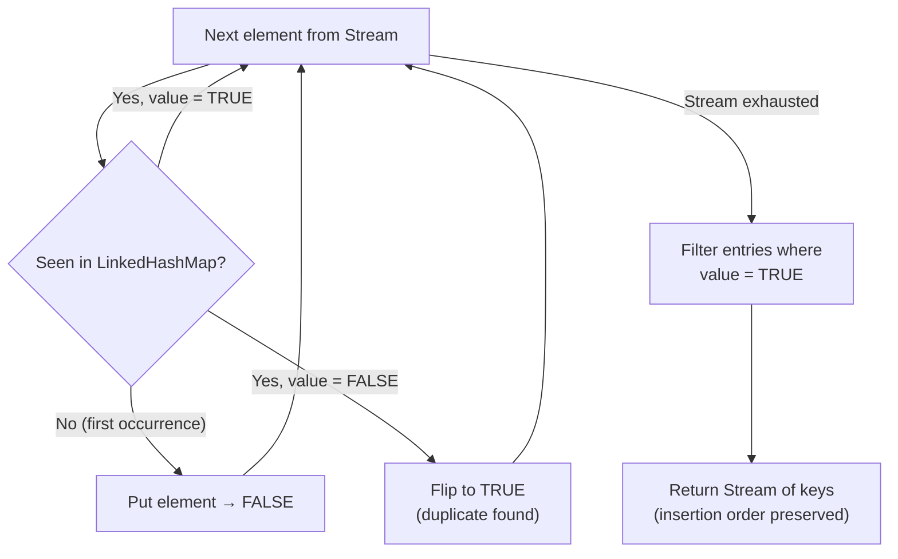

# Duplicate Finder - Stage 1 (In-Memory)

A small Java library that detects duplicate elements in a `Stream`, returning them in first-occurrence order.

## Requirements

- JDK 17+
- Maven 3.9+ (or use `mvn` wrapper)

## Usage

```java
import com.streamutils.duplicates.DuplicateFinder;

Stream<String> input  = Stream.of("b","a","c","c","e","a","c","d","c","d");
Stream<String> result = DuplicateFinder.findDuplicates(input);
// result: ["a", "c", "d"]
```

## Build & Test

```bash
mvn clean test
```

## Design

- **Algorithm**: Single-pass using `LinkedHashMap`. First occurrence maps to `FALSE`, repeats flip to `TRUE`. Filter for `TRUE` entries gives duplicates in insertion order.
- **Complexity**: O(n) time, O(n) space - assumes the stream fits in memory.
- **Nulls**: Rejected with `NullPointerException`.
- **No third-party libraries** in main code; JUnit 5 for tests.


