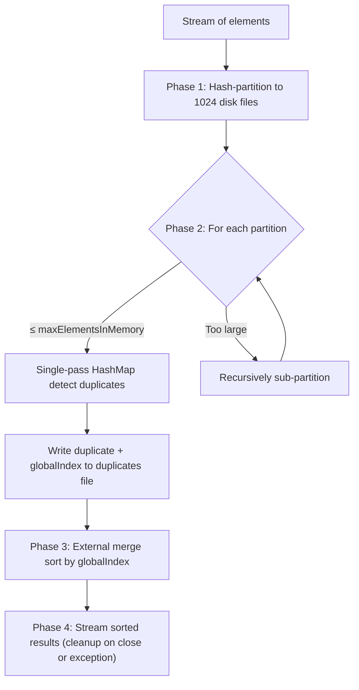

# Duplicate Finder - Stage 2 (Disk-Backed, Unbounded Streams)

Extends Stage 1 to handle unbounded streams in memory-constrained environments.

## What Changed

The original in-memory `findDuplicates(Stream<T>)` is preserved. A new overload is added:

```java
DuplicateFinder.findDuplicates(stream, maxElementsInMemory);
```

## How It Works

1. **Hash partition** the stream into 1024 disk files by `hashCode()`. Each record stores `(globalIndex, element)`.
2. **For each partition**: if it fits in memory (`≤ maxElementsInMemory`), load into a `HashMap` and detect duplicates in a single pass. If too large, **recursively sub-partition** with a level-mixed hash (up to 8 levels deep).
3. **External merge sort** the collected duplicate records by global index using `ExternalSorter` (sorted runs + k-way merge).
4. **Stream** the sorted results lazily, cleaning up temp files on completion or on exception.



## Memory Guarantees

- Partitions that exceed `maxElementsInMemory` are recursively split until they fit.
- External sort uses bounded memory (sorted runs + k-way merge via PriorityQueue).
- Only leaf partitions are loaded fully; everything else stays on disk.

## Requirements

- JDK 17+
- Maven 3.9+

## Build & Test

```bash
mvn clean test
```

## Usage

```java
// In-memory (Stage 1 - bounded streams)
Stream<String> result = DuplicateFinder.findDuplicates(stream);

// Disk-backed (Stage 2 - unbounded streams)
Stream<String> result = DuplicateFinder.findDuplicates(stream, 100_000);
```

## Design Decisions

- **No third-party libraries** in main code.
- **Recursive hash partitioning** (1024 buckets, up to 8 levels) guarantees bounded memory regardless of input size.
- **External merge sort** avoids loading all duplicates into memory for ordering.
- **Temp files** are cleaned up on stream consumption and on exceptions.
- **`maxElementsInMemory`** is a count of elements, not bytes. If elements vary significantly in size, use a smaller value to stay within your memory budget.
- **`BloomFilter`** is retained as a utility class but not used in the main algorithm - partitioning handles everything without probabilistic tradeoffs.
